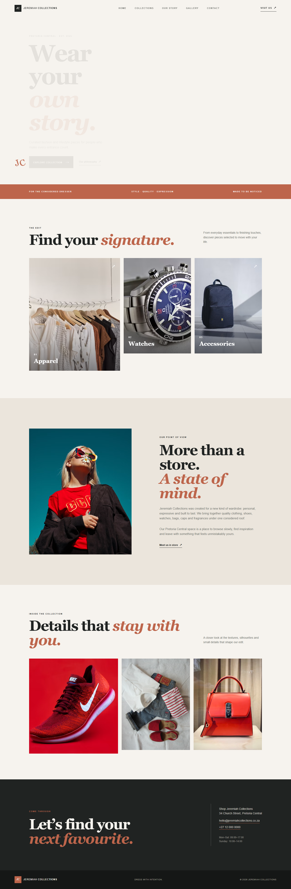
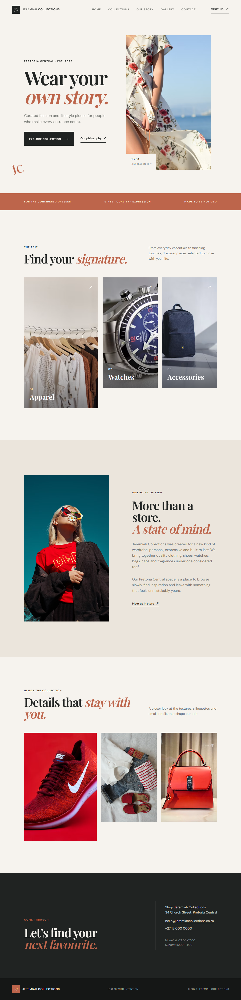
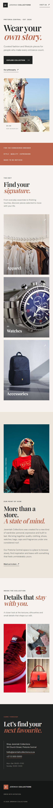

# Jeremiah Collections Website

## Project Overview
Jeremiah Collections is a responsive fashion and lifestyle website for a fictional retail store in Pretoria Central. The website presents the organisation, product categories, visual identity, store story and contact information in a clear multi-page experience.

## Organisation Overview
- **Name:** Jeremiah Collections
- **Location:** 34 Church Street, Pretoria Central
- **Industry:** Fashion and lifestyle retail
- **Target audience:** Style-conscious shoppers looking for quality apparel and finishing pieces

## Website Goals and KPIs
- Present the store as modern, welcoming and locally relevant.
- Help visitors browse apparel, watches and accessories quickly.
- Make the store location, opening hours and contact details easy to find.
- KPIs: page visits, collection-page clicks, contact clicks and in-store enquiries.

## Pages and Features
- `index.html` - homepage and first-viewport brand introduction.
- `products.html` - apparel, watches and accessories collection page.
- `about.html` - organisation story, values and brand point of view.
- `gallery.html` - visual gallery of the collection and styling direction.
- `contact.html` - address, opening hours, email and phone details.
- `styles.css` - shared external stylesheet with responsive breakpoints.
- `capture-screenshots.mjs` - browser automation script for submission evidence.
- `screenshots/` - desktop, tablet and mobile render evidence.

## Design and Technical Requirements
- Semantic HTML5 elements: header, nav, main, section, article, figure and footer.
- External CSS stylesheet with reusable custom properties and responsive media queries.
- Relative navigation links between all pages.
- Descriptive alternative text for images.
- Typography uses Playfair Display for headings and DM Sans for body copy.
- Responsive image loading uses `srcset` and `sizes` attributes.
- Relative CSS units, percentages, media queries and breakpoint-specific layouts are used.
- Layout tested for desktop, tablet and mobile widths.

## Assignment Checklist
- [x] Target organisation and audience identified.
- [x] Website goals, features and KPIs documented.
- [x] Five linked HTML pages created.
- [x] Semantic HTML structure implemented.
- [x] External stylesheet linked to every page.
- [x] Visual assets, alternative text and responsive image loading added.
- [x] Typography, layout, colour and interactive states styled with CSS.
- [x] Responsive breakpoints and relative units implemented.
- [x] Navigation tested across pages.
- [x] Code comments added for non-obvious shared styling decisions.
- [x] Desktop, tablet and mobile screenshots captured below.
- [x] Project pushed to the GitHub repository.

The proposal document's Calibri 11-point and 1.5 line-spacing rules apply to the written proposal document. The website follows the Part 2 web-typography requirement with a deliberate display/body font pairing, readable sizing and responsive spacing.

## Screenshot Evidence






## Project Timeline
1. Research and proposal: identify the target audience, objectives and visual direction.
2. HTML foundation: create the page structure, navigation and content sections.
3. Visual design: add colour, typography, spacing, imagery and responsive behaviour.
4. Testing and refinement: check page links, rendering, accessibility labels and browser console output.
5. Submission preparation: update this README and organise the project files.

## Testing Evidence
The local static server was run with `python -m http.server 4173`. Browser validation confirmed:
- All five navigation links resolve to the expected pages.
- The homepage loads with no console errors or failed image requests.
- The project contains six content sections on the homepage and eight visual assets.
- Desktop, tablet and mobile screenshots were captured with `capture-screenshots.mjs`.
- The editor reports no errors in the HTML or CSS files.

## References
- Image assets: Unsplash, accessed September 2026, used through responsive image URLs.
- Fonts: Google Fonts, Playfair Display and DM Sans, accessed September 2026.
- Project brief: Jeremiah Collections Proposal, supplied with the assignment.

## Local Preview
From this folder, run:

```text
python -m http.server 4173
```

Then open `http://127.0.0.1:4173/` in a browser.
